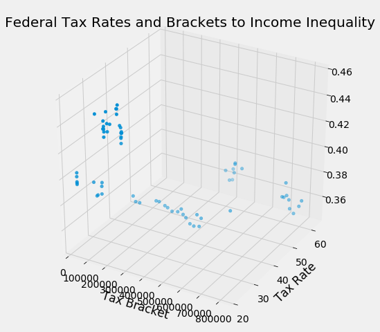

```python
# Run this cell to set up the notebook, but please don't change it.

import numpy as np
import math
from datascience import *

# These lines set up the plotting functionality and formatting.
import matplotlib
matplotlib.use('Agg', warn=False)
%matplotlib inline
import matplotlib.pyplot as plots
plots.style.use('fivethirtyeight')
import warnings
warnings.simplefilter(action="ignore", category=FutureWarning)

from client.api.notebook import Notebook
ok = Notebook('exploration.ok')
_ = ok.auth(inline=True)

#For 3D plots and scatters
from mpl_toolkits.mplot3d import Axes3D
```

    =====================================================================
    Assignment: Independent Data Exploration
    OK, version v1.12.5
    =====================================================================
    
    Successfully logged in as alanliang@berkeley.edu


# Abstract and Introduction

## Abstract
This exploration focuses on the effects that federal income taxes have on income inequality in the United States. A 3-dimensional linear regression model (regression plane) that takes both income tax rates and income tax bracket intervals as its independent variables will be created to predict income inequality. Consequently, this model will be used to predict the potential changes in income inequality due to the upcoming Trump tax cuts that are currently going through Congress.

## Some Basic Concepts
**Federal Income Tax** In the US, the federal income tax is a progressive tax divided into 'brackets', in which so that indivdiuals or households who earn between a certain interval are taxed the same percentage. 

**Income Inequality** The numerical measure for income inequality used in this exploration will be the [gini coefficient](https://en.wikipedia.org/wiki/Gini_coefficient). I won't explain how the gini coefficient is calculated, but just know that the coefficient ranges from 0 to 1, with a lower value meaning less inequality. Currently and generally, most countries have a gini coefficient in the 0.3 to 0.6 range.

# I. Making the Data Manipulable (Data importing and cleaning)

## 1. Gini Index Table


```python
gini = Table().read_table('gini.csv')
gini
```


<table border="1" class="dataframe">
    <thead>
        <tr>
            <th>DATE</th> <th>GINIALLRF</th>
        </tr>
    </thead>
    <tbody>
        <tr>
            <td>1947-01-01</td> <td>0.376    </td>
        </tr>
    </tbody>
        <tr>
            <td>1948-01-01</td> <td>0.371    </td>
        </tr>
    </tbody>
        <tr>
            <td>1949-01-01</td> <td>0.378    </td>
        </tr>
    </tbody>
        <tr>
            <td>1950-01-01</td> <td>0.379    </td>
        </tr>
    </tbody>
        <tr>
            <td>1951-01-01</td> <td>0.363    </td>
        </tr>
    </tbody>
        <tr>
            <td>1952-01-01</td> <td>0.368    </td>
        </tr>
    </tbody>
        <tr>
            <td>1953-01-01</td> <td>0.359    </td>
        </tr>
    </tbody>
        <tr>
            <td>1954-01-01</td> <td>0.371    </td>
        </tr>
    </tbody>
        <tr>
            <td>1955-01-01</td> <td>0.363    </td>
        </tr>
    </tbody>
        <tr>
            <td>1956-01-01</td> <td>0.358    </td>
        </tr>
    </tbody>
</table>
<p>... (60 rows omitted)</p


```python
dates = gini.column(0)
for i in range(dates.size):
    dates[i] = dates[i][0:4]
dates = dates.astype(int)
```


```python
gini = Table().with_columns("Year", dates,
                            "Gini", gini.column(1))
gini.sort(0, descending=True)
```


<table border="1" class="dataframe">
    <thead>
        <tr>
            <th>Year</th> <th>Gini</th>
        </tr>
    </thead>
    <tbody>
        <tr>
            <td>2016</td> <td>0.452</td>
        </tr>
    </tbody>
        <tr>
            <td>2015</td> <td>0.448</td>
        </tr>
    </tbody>
        <tr>
            <td>2014</td> <td>0.452</td>
        </tr>
    </tbody>
        <tr>
            <td>2013</td> <td>0.455</td>
        </tr>
    </tbody>
        <tr>
            <td>2012</td> <td>0.451</td>
        </tr>
    </tbody>
        <tr>
            <td>2011</td> <td>0.45 </td>
        </tr>
    </tbody>
        <tr>
            <td>2010</td> <td>0.44 </td>
        </tr>
    </tbody>
        <tr>
            <td>2009</td> <td>0.443</td>
        </tr>
    </tbody>
        <tr>
            <td>2008</td> <td>0.438</td>
        </tr>
    </tbody>
        <tr>
            <td>2007</td> <td>0.432</td>
        </tr>
    </tbody>
</table>
<p>... (60 rows omitted)</p


## 2. Top tax rate per year table


```python
toptax = Table.read_table('toptaxrate.csv')
toptax
```


<table border="1" class="dataframe">
    <thead>
        <tr>
            <th>Year</th> <th>Top Marginal Rate</th>
        </tr>
    </thead>
    <tbody>
        <tr>
            <td>1913</td> <td>7.0%             </td>
        </tr>
    </tbody>
        <tr>
            <td>1914</td> <td>7.0%             </td>
        </tr>
    </tbody>
        <tr>
            <td>1915</td> <td>7.0%             </td>
        </tr>
    </tbody>
        <tr>
            <td>1916</td> <td>15.0%            </td>
        </tr>
    </tbody>
        <tr>
            <td>1917</td> <td>67.0%            </td>
        </tr>
    </tbody>
        <tr>
            <td>1918</td> <td>77.0%            </td>
        </tr>
    </tbody>
        <tr>
            <td>1919</td> <td>73.0%            </td>
        </tr>
    </tbody>
        <tr>
            <td>1920</td> <td>73.0%            </td>
        </tr>
    </tbody>
        <tr>
            <td>1921</td> <td>73.0%            </td>
        </tr>
    </tbody>
        <tr>
            <td>1922</td> <td>58.0%            </td>
        </tr>
    </tbody>
</table>
<p>... (95 rows omitted)</p


```python
toptaxrate = toptax.column(1)
for i in range(toptaxrate.size):
    toptaxrate[i] = toptaxrate[i][0:len(toptaxrate[i])-1]
toptaxrate = toptaxrate.astype(float)
toptaxrate
```


    array([  7.  ,   7.  ,   7.  ,  15.  ,  67.  ,  77.  ,  73.  ,  73.  ,
            73.  ,  58.  ,  43.5 ,  46.  ,  25.  ,  25.  ,  25.  ,  25.  ,
            24.  ,  25.  ,  25.  ,  63.  ,  63.  ,  63.  ,  63.  ,  79.  ,
            79.  ,  79.  ,  79.  ,  81.1 ,  81.  ,  88.  ,  88.  ,  94.  ,
            94.  ,  86.45,  86.45,  82.13,  82.13,  84.36,  91.  ,  92.  ,
            92.  ,  91.  ,  91.  ,  91.  ,  91.  ,  91.  ,  91.  ,  91.  ,
            91.  ,  91.  ,  91.  ,  77.  ,  70.  ,  70.  ,  70.  ,  75.25,
            77.  ,  71.75,  70.  ,  70.  ,  70.  ,  70.  ,  70.  ,  70.  ,
            70.  ,  70.  ,  70.  ,  70.  ,  69.13,  50.  ,  50.  ,  50.  ,
            50.  ,  50.  ,  38.5 ,  28.  ,  28.  ,  28.  ,  31.  ,  31.  ,
            39.6 ,  39.6 ,  39.6 ,  39.6 ,  39.6 ,  39.6 ,  39.6 ,  39.6 ,
            39.1 ,  38.6 ,  35.  ,  35.  ,  35.  ,  35.  ,  35.  ,  35.  ,
            35.  ,  35.  ,  35.  ,  35.  ,  39.6 ,  39.6 ,  39.6 ,  39.6 ,
            39.6 ])


```python
toptax = Table().with_columns("Year", toptax.column(0),
                              "Tax Rate", toptaxrate)
toptax.sort(0,descending=True)
```


<table border="1" class="dataframe">
    <thead>
        <tr>
            <th>Year</th> <th>Tax Rate</th>
        </tr>
    </thead>
    <tbody>
        <tr>
            <td>2017</td> <td>39.6    </td>
        </tr>
    </tbody>
        <tr>
            <td>2016</td> <td>39.6    </td>
        </tr>
    </tbody>
        <tr>
            <td>2015</td> <td>39.6    </td>
        </tr>
    </tbody>
        <tr>
            <td>2014</td> <td>39.6    </td>
        </tr>
    </tbody>
        <tr>
            <td>2013</td> <td>39.6    </td>
        </tr>
    </tbody>
        <tr>
            <td>2012</td> <td>35      </td>
        </tr>
    </tbody>
        <tr>
            <td>2011</td> <td>35      </td>
        </tr>
    </tbody>
        <tr>
            <td>2010</td> <td>35      </td>
        </tr>
    </tbody>
        <tr>
            <td>2009</td> <td>35      </td>
        </tr>
    </tbody>
        <tr>
            <td>2008</td> <td>35      </td>
        </tr>
    </tbody>
</table>
<p>... (95 rows omitted)</p


## 3. CPI (price level) table


```python
cpi = Table().read_table("cpi.csv")
cpi_date = cpi.column(0)
new_dates = make_array()
for date in cpi_date:
    if date[5:7] == "06":
        new_dates = np.append(new_dates, date)
cpi = cpi.where(0, new_dates).relabel(1, "CPI").relabel(0, "Year")

cpi_date = cpi.column(0)
for i in range(len(cpi_date)):
    cpi_date[i] = cpi_date[i][:4]
cpi_date = cpi_date.astype(int)
cpi = Table().with_columns("Year", cpi_date, "CPI", cpi.column(1))
cpi.sort(0, descending = True)
```


<table border="1" class="dataframe">
    <thead>
        <tr>
            <th>Year</th> <th>CPI</th>
        </tr>
    </thead>
    <tbody>
        <tr>
            <td>2017</td> <td>243.79 </td>
        </tr>
    </tbody>
        <tr>
            <td>2016</td> <td>239.842</td>
        </tr>
    </tbody>
        <tr>
            <td>2015</td> <td>237.419</td>
        </tr>
    </tbody>
        <tr>
            <td>2014</td> <td>237.029</td>
        </tr>
    </tbody>
        <tr>
            <td>2013</td> <td>232.374</td>
        </tr>
    </tbody>
        <tr>
            <td>2012</td> <td>228.524</td>
        </tr>
    </tbody>
        <tr>
            <td>2011</td> <td>224.806</td>
        </tr>
    </tbody>
        <tr>
            <td>2010</td> <td>217.199</td>
        </tr>
    </tbody>
        <tr>
            <td>2009</td> <td>214.79 </td>
        </tr>
    </tbody>
        <tr>
            <td>2008</td> <td>217.463</td>
        </tr>
    </tbody>
</table>
<p>... (61 rows omitted)</p


## 4. Annual tax bracket table


```python
non_adjusted = Table().read_table("nonAdjustedTax.csv")
non_adjusted = non_adjusted.drop(4,5)
non_adjusted
```


<table border="1" class="dataframe">
    <thead>
        <tr>
            <th>Year</th> <th>Tax Rate</th> <th>Above</th> <th>Below</th>
        </tr>
    </thead>
    <tbody>
        <tr>
            <td>2017</td> <td>10.0%   </td> <td>$0      </td> <td>$17,850 </td>
        </tr>
    </tbody>
        <tr>
            <td>2017</td> <td>15.0%   </td> <td>$17,850 </td> <td>$72,500 </td>
        </tr>
    </tbody>
        <tr>
            <td>2017</td> <td>25.0%   </td> <td>$72,500 </td> <td>$146,400</td>
        </tr>
    </tbody>
        <tr>
            <td>2017</td> <td>28.0%   </td> <td>$146,400</td> <td>$223,050</td>
        </tr>
    </tbody>
        <tr>
            <td>2017</td> <td>33.0%   </td> <td>$223,050</td> <td>$398,350</td>
        </tr>
    </tbody>
        <tr>
            <td>2017</td> <td>35.0%   </td> <td>$398,350</td> <td>$450,000</td>
        </tr>
    </tbody>
        <tr>
            <td>2017</td> <td>39.6%   </td> <td>$450,000</td> <td>nan     </td>
        </tr>
    </tbody>
        <tr>
            <td>2016</td> <td>10.0%   </td> <td>$0      </td> <td>$17,850 </td>
        </tr>
    </tbody>
        <tr>
            <td>2016</td> <td>15.0%   </td> <td>$17,850 </td> <td>$72,500 </td>
        </tr>
    </tbody>
        <tr>
            <td>2016</td> <td>25.0%   </td> <td>$72,500 </td> <td>$146,400</td>
        </tr>
    </tbody>
</table>
<p>... (1057 rows omitted)</p


```python
above_col = non_adjusted.column(2)
for i in range(above_col.size):
    if above_col[i][0] == '$':
        above_col[i] = above_col[i][1:]
    number = above_col[i]
    for j in range(len(number)):
        if number[j] == ',':
            above_col[i] = str(number[:j]) + str(number[j+1:])
above_col = above_col.astype(int)
above_col
```


    array([     0,  17850,  72500, ..., 100000, 150000, 200000])


```python
percent_col = non_adjusted.column(1)
for i in range(percent_col.size):
    percent_col[i] = percent_col[i][:-1]
percent_col = percent_col.astype(float)
percent_col
```


    array([ 10.,  15.,  25., ...,  89.,  90.,  91.])


```python
non_adjusted = non_adjusted.drop(1,2,3).with_columns("Tax Rate", percent_col, "Lower", above_col)
non_adjusted
```


<table border="1" class="dataframe">
    <thead>
        <tr>
            <th>Year</th> <th>Tax Rate</th> <th>Lower</th>
        </tr>
    </thead>
    <tbody>
        <tr>
            <td>2017</td> <td>10      </td> <td>0     </td>
        </tr>
    </tbody>
        <tr>
            <td>2017</td> <td>15      </td> <td>17850 </td>
        </tr>
    </tbody>
        <tr>
            <td>2017</td> <td>25      </td> <td>72500 </td>
        </tr>
    </tbody>
        <tr>
            <td>2017</td> <td>28      </td> <td>146400</td>
        </tr>
    </tbody>
        <tr>
            <td>2017</td> <td>33      </td> <td>223050</td>
        </tr>
    </tbody>
        <tr>
            <td>2017</td> <td>35      </td> <td>398350</td>
        </tr>
    </tbody>
        <tr>
            <td>2017</td> <td>39.6    </td> <td>450000</td>
        </tr>
    </tbody>
        <tr>
            <td>2016</td> <td>10      </td> <td>0     </td>
        </tr>
    </tbody>
        <tr>
            <td>2016</td> <td>15      </td> <td>17850 </td>
        </tr>
    </tbody>
        <tr>
            <td>2016</td> <td>25      </td> <td>72500 </td>
        </tr>
    </tbody>
</table>
<p>... (1057 rows omitted)</p


So... a couple notes:
    1. We will only be looking into federal tax rates. 
    2. All tax rates and brackets within our scope are for the US from 1947 onwards to 2016. 
    3. All tax rates and brackets are assumed to be for families filing jointly, with some exceptions due to different legislation throughout the years

# 2. A First Look: Top tax rate to income inequality

In this section, I will simply look at the correlation between the tax rate of the highest bracket and income inequality.


```python
top_tax_joined = toptax.join("Year", gini, "Year")
top_tax_joined
```


<table border="1" class="dataframe">
    <thead>
        <tr>
            <th>Year</th> <th>Tax Rate</th> <th>Gini</th>
        </tr>
    </thead>
    <tbody>
        <tr>
            <td>1947</td> <td>86.45   </td> <td>0.376</td>
        </tr>
    </tbody>
        <tr>
            <td>1948</td> <td>82.13   </td> <td>0.371</td>
        </tr>
    </tbody>
        <tr>
            <td>1949</td> <td>82.13   </td> <td>0.378</td>
        </tr>
    </tbody>
        <tr>
            <td>1950</td> <td>84.36   </td> <td>0.379</td>
        </tr>
    </tbody>
        <tr>
            <td>1951</td> <td>91      </td> <td>0.363</td>
        </tr>
    </tbody>
        <tr>
            <td>1952</td> <td>92      </td> <td>0.368</td>
        </tr>
    </tbody>
        <tr>
            <td>1953</td> <td>92      </td> <td>0.359</td>
        </tr>
    </tbody>
        <tr>
            <td>1954</td> <td>91      </td> <td>0.371</td>
        </tr>
    </tbody>
        <tr>
            <td>1955</td> <td>91      </td> <td>0.363</td>
        </tr>
    </tbody>
        <tr>
            <td>1956</td> <td>91      </td> <td>0.358</td>
        </tr>
    </tbody>
</table>
<p>... (60 rows omitted)</p


Let's take a look at how the top bracket tax rate and income inequality have changed over the last 70 years.


```python
top_tax_joined.plot(0,1)
```


```python
top_tax_joined.plot(0,2)
```


It appears that over the last 70 years, the top tax rates have decreased significantly from 90% in the 50s to 40% today, while income inequality has grown considerably. This suggests some sort of inverse relationship between the two, so let's create a scatter to see the relationship:


```python
top_tax_joined.scatter(1,2)
```


Now to find the correlation coefficient r:


```python
def standard_units(array):
    mean = np.mean(array)
    std = np.std(array)
    return (array-mean)/std
```


```python
standardized_top_tax = Table().with_columns("Year", top_tax_joined.column(0),
                                            "Tax", standard_units(top_tax_joined.column(1)),
                                            "Gini", standard_units(top_tax_joined.column(2)))
standardized_top_tax
```


<table border="1" class="dataframe">
    <thead>
        <tr>
            <th>Year</th> <th>Tax</th> <th>Gini</th>
        </tr>
    </thead>
    <tbody>
        <tr>
            <td>1947</td> <td>1.22235</td> <td>-0.46511 </td>
        </tr>
    </tbody>
        <tr>
            <td>1948</td> <td>1.02921</td> <td>-0.606053</td>
        </tr>
    </tbody>
        <tr>
            <td>1949</td> <td>1.02921</td> <td>-0.408733</td>
        </tr>
    </tbody>
        <tr>
            <td>1950</td> <td>1.12891</td> <td>-0.380545</td>
        </tr>
    </tbody>
        <tr>
            <td>1951</td> <td>1.42576</td> <td>-0.831561</td>
        </tr>
    </tbody>
        <tr>
            <td>1952</td> <td>1.47047</td> <td>-0.690619</td>
        </tr>
    </tbody>
        <tr>
            <td>1953</td> <td>1.47047</td> <td>-0.944315</td>
        </tr>
    </tbody>
        <tr>
            <td>1954</td> <td>1.42576</td> <td>-0.606053</td>
        </tr>
    </tbody>
        <tr>
            <td>1955</td> <td>1.42576</td> <td>-0.831561</td>
        </tr>
    </tbody>
        <tr>
            <td>1956</td> <td>1.42576</td> <td>-0.972504</td>
        </tr>
    </tbody>
</table>
<p>... (60 rows omitted)</p


```python
def correlation(tbl):
    return np.mean(tbl.column(0)*tbl.column(1))
```


```python
r = correlation(standardized_top_tax.drop(0))
r
```


    -0.82755794861840815


There appears to be a strong correlation between the top tax rate and income inequality. However, we have greatly simplified something for our correlation above: our tax rate only takes into account the top tax rate!

Specifically, if our goal was to predict the potentially upcoming Trump tax cuts, we would not get any significant result as the plan will not really change the highest tax rate, but rather the amount of income one earns to qualify into this bracket. (i.e. the top bracket is supposed to go from 400k per year to 1 million per year, while not changing much in tax rate.)

In fact, historically, there were many more brackets than those we have now, which means that the top tax brackets 60-70 years ago only affected a smaller percentage of people. 

Therefore, for the next step, we must consider both tax rate and the income interval for each tax bracket.

# 3. Going 3 dimensional: Using tax brackets

Although our data above appear to have a strong correlation, there is not information for us to make an estimation on the upcoming tax cuts.
Specifically, for the last for the last 25 years, the tax brackets have basically been the same, with the top tax bracket at the 39.6% level. However, the income interval each bracket corresponds to have been shifting almsot annually.
This means that we must consider **both** the income bracket and the tax rate when doing our regression.


## 1. Adjusting for inflation

Our table "non_adjusted" has all the historical data on tax rates and the incomes it corresponded to, but it is not adjusted to inflation. So, our first step is to adjust all values to inflation in 2017 dollars. The equation to convert to 2017 dollars is: 

$\text{Price in 2017 dollars} = \frac{\text{CPI in 2017}}{\text{CPI in original year}} \times \text{Price in original year}$


```python
tax_cpi_join = non_adjusted.join("Year", cpi, "Year")
tax_cpi_join
```


<table border="1" class="dataframe">
    <thead>
        <tr>
            <th>Year</th> <th>Tax Rate</th> <th>Above</th> <th>CPI</th>
        </tr>
    </thead>
    <tbody>
        <tr>
            <td>1947</td> <td>20      </td> <td>0    </td> <td>22.08</td>
        </tr>
    </tbody>
        <tr>
            <td>1947</td> <td>22      </td> <td>2000 </td> <td>22.08</td>
        </tr>
    </tbody>
        <tr>
            <td>1947</td> <td>26      </td> <td>4000 </td> <td>22.08</td>
        </tr>
    </tbody>
        <tr>
            <td>1947</td> <td>30      </td> <td>6000 </td> <td>22.08</td>
        </tr>
    </tbody>
        <tr>
            <td>1947</td> <td>34      </td> <td>8000 </td> <td>22.08</td>
        </tr>
    </tbody>
        <tr>
            <td>1947</td> <td>38      </td> <td>10000</td> <td>22.08</td>
        </tr>
    </tbody>
        <tr>
            <td>1947</td> <td>43      </td> <td>12000</td> <td>22.08</td>
        </tr>
    </tbody>
        <tr>
            <td>1947</td> <td>47      </td> <td>14000</td> <td>22.08</td>
        </tr>
    </tbody>
        <tr>
            <td>1947</td> <td>50      </td> <td>16000</td> <td>22.08</td>
        </tr>
    </tbody>
        <tr>
            <td>1947</td> <td>53      </td> <td>18000</td> <td>22.08</td>
        </tr>
    </tbody>
</table>
<p>... (1057 rows omitted)</p


```python
current_CPI = cpi.column(1)[-1]
adjusted = tax_cpi_join.column(2) / (tax_cpi_join.column(3)) * current_CPI
adjusted
```


    array([      0.        ,   22082.42753623,   44164.85507246, ...,
            223050.        ,  398350.        ,  450000.        ])


```python
adjusted_tax = tax_cpi_join.drop(2,3).with_columns("Income bracket", adjusted)
adjusted_tax = adjusted_tax.drop(1,2).with_columns("Income bracket", adjusted_tax.column(2), 
                                                   "Tax Rate", adjusted_tax.column(1))
adjusted_tax
```


<table border="1" class="dataframe">
    <thead>
        <tr>
            <th>Year</th> <th>Income bracket</th> <th>Tax Rate</th>
        </tr>
    </thead>
    <tbody>
        <tr>
            <td>1947</td> <td>0             </td> <td>20      </td>
        </tr>
    </tbody>
        <tr>
            <td>1947</td> <td>22082.4       </td> <td>22      </td>
        </tr>
    </tbody>
        <tr>
            <td>1947</td> <td>44164.9       </td> <td>26      </td>
        </tr>
    </tbody>
        <tr>
            <td>1947</td> <td>66247.3       </td> <td>30      </td>
        </tr>
    </tbody>
        <tr>
            <td>1947</td> <td>88329.7       </td> <td>34      </td>
        </tr>
    </tbody>
        <tr>
            <td>1947</td> <td>110412        </td> <td>38      </td>
        </tr>
    </tbody>
        <tr>
            <td>1947</td> <td>132495        </td> <td>43      </td>
        </tr>
    </tbody>
        <tr>
            <td>1947</td> <td>154577        </td> <td>47      </td>
        </tr>
    </tbody>
        <tr>
            <td>1947</td> <td>176659        </td> <td>50      </td>
        </tr>
    </tbody>
        <tr>
            <td>1947</td> <td>198742        </td> <td>53      </td>
        </tr>
    </tbody>
</table>
<p>... (1057 rows omitted)</p


Let's take a look at this table. When we plot tax rates for each bracket over time:


```python
adjusted_tax.scatter(0,2)
```


We can see that taxes have been decreasing in the last 70 years. 
Notice that there is a big shift in tax rate brackets around 1980; these are the 1st Reagan tax cuts. In addition, the large shift in tax rates around 1964 are the LBJ's tax cuts. Lastly, the more recent Bush's tax cuts can also be seen at around the 2001 mark, where all brackets took a small ~3% drop each.

Now let's take a look at the tax rate to income, adjusted to 2017 dollars:


```python
adjusted_tax.scatter(1,2)
```


At some point in time, the US used to tax up to 90% of income! This tax appeared to only apply to the super-rich that made more than 3.5 million dollars in today's price levels.

## 2. Bringing Income Inequality into the Picture


```python
combined = adjusted_tax.join("Year", gini, "Year")
combined
```


<table border="1" class="dataframe">
    <thead>
        <tr>
            <th>Year</th> <th>Income bracket</th> <th>Tax Rate</th> <th>Gini</th>
        </tr>
    </thead>
    <tbody>
        <tr>
            <td>1947</td> <td>0             </td> <td>20      </td> <td>0.376</td>
        </tr>
    </tbody>
        <tr>
            <td>1947</td> <td>22082.4       </td> <td>22      </td> <td>0.376</td>
        </tr>
    </tbody>
        <tr>
            <td>1947</td> <td>44164.9       </td> <td>26      </td> <td>0.376</td>
        </tr>
    </tbody>
        <tr>
            <td>1947</td> <td>66247.3       </td> <td>30      </td> <td>0.376</td>
        </tr>
    </tbody>
        <tr>
            <td>1947</td> <td>88329.7       </td> <td>34      </td> <td>0.376</td>
        </tr>
    </tbody>
        <tr>
            <td>1947</td> <td>110412        </td> <td>38      </td> <td>0.376</td>
        </tr>
    </tbody>
        <tr>
            <td>1947</td> <td>132495        </td> <td>43      </td> <td>0.376</td>
        </tr>
    </tbody>
        <tr>
            <td>1947</td> <td>154577        </td> <td>47      </td> <td>0.376</td>
        </tr>
    </tbody>
        <tr>
            <td>1947</td> <td>176659        </td> <td>50      </td> <td>0.376</td>
        </tr>
    </tbody>
        <tr>
            <td>1947</td> <td>198742        </td> <td>53      </td> <td>0.376</td>
        </tr>
    </tbody>
</table>
<p>... (1050 rows omitted)</p


```python
ax = matplotlib.pyplot.figure(figsize=(8,8)).add_subplot(111, projection='3d')
ax.scatter(combined.column(1), 
           combined.column(2), 
           combined.column(3));
```


Let's visualize our brackets and tax rates. I will categorically divide up our tax data by time into 3 periods. The 3 periods I have chosen are:

Red: **Pre-LBJ era (Before 1965)** signified by very high tax rates and many brackets.

Green: **Pre-Reagan era (Before 1982)** categorized by considerably lower tax rates by around 20% than before across the board, but still with many tax brackets.

Blue: **Reagan-Bush era** even lower tax rates and also greatly reduced the amount of tax brackets.
    
These differences in tax rates in each period can be seen in the graph directly below, which plots all tax rates with respect to time.


```python
adjusted_tax.scatter(0,2)
plots.axvline(x=1964, alpha = 0.3, c = "red")
plots.axvline(x=1981, alpha = 0.3, c = "green")
```


    <matplotlib.lines.Line2D at 0x7fb9762a6358>


```python
color = make_array()
for i in range(combined.num_rows):
    if combined.row(i)[0] <= 1964:
        color = np.append(color, "red")
    elif combined.row(i)[0] <= 1981:
        color = np.append(color, "green")
    else:
        color = np.append(color, "blue")
combined_colors = combined.with_columns("Color", color)
combined_colors.scatter(1,2, color = combined_colors.column(4))
```


```python
ax = matplotlib.pyplot.figure(figsize=(8,8)).add_subplot(111, projection='3d')
ax.scatter(combined_colors.column(1), 
           combined_colors.column(2), 
           combined_colors.column(3), c = combined_colors.column(4));
```


The effects are clearly visible: from the blue dots, having less tax brackets at lower tax rates and lower income levels increase income inequality.

## 3. Aggregating each year into 1 point

Unfortunately, there are too many tax rate + income points for us to conduct any meaningful regression from the above scatter. Therefore, we must aggregate each year's tax rates and brackets into 1 (x,y) value.

I have simply chosen to take the arithmetic average of the income and tax rate for each year. An improvement could be to take the geometric average for the tax income, as generally the tax brackets scale exponentially, but there are a couple complicating problems with this that are hard to resolve.


```python
aggregated = combined.group(0, np.average)
aggregated
```


<table border="1" class="dataframe">
    <thead>
        <tr>
            <th>Year</th> <th>Income bracket average</th> <th>Tax Rate average</th> <th>Gini average</th>
        </tr>
    </thead>
    <tbody>
        <tr>
            <td>1947</td> <td>493174                </td> <td>59.2083         </td> <td>0.376       </td>
        </tr>
    </tbody>
        <tr>
            <td>1948</td> <td>450902                </td> <td>59.2083         </td> <td>0.371       </td>
        </tr>
    </tbody>
        <tr>
            <td>1949</td> <td>455238                </td> <td>59.2083         </td> <td>0.378       </td>
        </tr>
    </tbody>
        <tr>
            <td>1950</td> <td>456000                </td> <td>59.2083         </td> <td>0.379       </td>
        </tr>
    </tbody>
        <tr>
            <td>1951</td> <td>419949                </td> <td>59.7417         </td> <td>0.363       </td>
        </tr>
    </tbody>
        <tr>
            <td>1952</td> <td>410452                </td> <td>62.575          </td> <td>0.368       </td>
        </tr>
    </tbody>
        <tr>
            <td>1953</td> <td>406772                </td> <td>62.575          </td> <td>0.359       </td>
        </tr>
    </tbody>
        <tr>
            <td>1954</td> <td>404205                </td> <td>59.2083         </td> <td>0.371       </td>
        </tr>
    </tbody>
        <tr>
            <td>1955</td> <td>815372                </td> <td>59.2083         </td> <td>0.363       </td>
        </tr>
    </tbody>
        <tr>
            <td>1956</td> <td>802157                </td> <td>59.2083         </td> <td>0.358       </td>
        </tr>
    </tbody>
</table>
<p>... (60 rows omitted)</p


Plotting this...


```python
ax = matplotlib.pyplot.figure(figsize=(8,8)).add_subplot(111, projection='3d')
ax.scatter(aggregated.column(1), 
           aggregated.column(2), 
           aggregated.column(3));
plots.title("Federal Tax Rates and Brackets to Income Inequality")
plots.xlabel("Tax Bracket")
plots.ylabel("Tax Rate")
```


    <matplotlib.text.Text at 0x7fb976752860>





```python
def find_aggregated_min(slope1, slope2, intercept):
    residual_sum = 0
    for i in range(aggregated.num_rows):
        x = aggregated.column(1)[i]
        y = aggregated.column(2)[i]
        predicted = x*slope1 + y*slope2 + intercept
        residual = (aggregated.column(3)[i]-predicted) ** 2
        residual_sum += residual
    return residual_sum
a = minimize(find_aggregated_min)
agg_s1 = a[0]
agg_s2 = a[1]
agg_intercept = a[2]
agg_s1, agg_s2, agg_intercept
```


    (4.6151120012371352e-08, -0.0024928577908792365, 0.47439075976966177)


```python
def predict_agg(x, y):
    return agg_s1*x + agg_s2*y + agg_intercept
```

Let's test this out on our 2016 data:


```python
x_2016 = aggregated.where(0, 2016).column(1).item(0)
y_2016 = aggregated.where(0, 2016).column(2).item(0)
predicted_2016 = predict_agg(x_2016, y_2016)
aggregated.where(0, 2016).column(3).item(0), predicted_2016
```


    (0.452, 0.41706104047886483)


One more for 1990's data:


```python
x_1990 = aggregated.where(0, 1990).column(1).item(0)
y_1990 = aggregated.where(0, 1990).column(2).item(0)
predicted_1990 = predict_agg(x_1990, y_1990)
actual_1990 = aggregated.where(0, 1990).column(3).item(0)
actual_1990, predicted_1990
```


    (0.396, 0.42219963228202695)


Our regresiion plane does not seem to be a very good predictor. It underpredicts 2016's income inequality and over predicts 1990's income inequality by a considerable amount. This is because fluctuations have been very large and 'averages' out the slope of the regression plane. Let's take a look at the residual RMS, which we will later use to compare to our improved model: 


```python
def residuals(table, s1, s2, intercept):
    residual_sum = 0
    for i in range(table.num_rows):
        predicted = table.column(1)[i]*s1 + table.column(2)[i]*s2 + intercept
        residual_sum += (table.column(3)[i] - predicted) ** 2
    return (residual_sum / table.num_rows) ** 0.5
residuals(aggregated, agg_s1, agg_s2, agg_intercept)
```


    0.023897082335873669


## 4. Null hypotheses tests

For the null hypothesis test we will test for the true slope on both dimensions and hence essentially do 2 hypothesis tests. The null hypotheses will be that the slope is 0 between either independent variable and the dependent variable, i.e. there is no correlational relationship between either independent variable with the dependent variable. On the other hand, the alternative hypothesis is that there is some correlation and hence slope between the 2 independent variables and the dependent variable.

Null hypothesis 1: there is no relationship between average incomes for the brackets and income inequality. The slope exists simply due to chance.

Null hypothesis 2: there is no relationship between the average tax rate and income inequality. The slope exists simply due to chance.


Let's first take a look at how these independent variables separately correlate with the dependent variable.


```python
aggregated.scatter(1,3)
```


```python
aggregated.scatter(2,3)
```


Now we can begin our 2 null hypotheses tests.


```python
def slope(table):
    def least_squares_estimate(X, b):
        # X - matrix
        # b - array
        return np.linalg.inv(X.T * X) * (X.T * np.matrix(b).T)
    tax_rate = table.column(1)
    tax_income = table.column(2)
    X = np.matrix([tax_rate, tax_income, [1 for _ in range(len(tax_rate))]]).T
    a = least_squares_estimate(X, table.column(3))
    return float(a[0]), float(a[1]), float(a[2])
```


```python
s1 = make_array()
s2 = make_array()
intercept = make_array()
for i in range(5000):
    table = aggregated.sample()
    result = slope(table)
    s1 = np.append(s1, result[0])
    s2 = np.append(s2, result[1])
    intercept = np.append(intercept, result[2])
slopes = Table().with_columns("Slope1", s1, "Slope2", s2, "Intercept", intercept)
slopes
```


<table border="1" class="dataframe">
    <thead>
        <tr>
            <th>Slope1</th> <th>Slope2</th> <th>Intercept</th>
        </tr>
    </thead>
    <tbody>
        <tr>
            <td>3.99716e-08</td> <td>-0.00228914</td> <td>0.4659   </td>
        </tr>
    </tbody>
        <tr>
            <td>4.29342e-08</td> <td>-0.00244149</td> <td>0.477644 </td>
        </tr>
    </tbody>
        <tr>
            <td>3.92586e-08</td> <td>-0.00241779</td> <td>0.471554 </td>
        </tr>
    </tbody>
        <tr>
            <td>5.87178e-08</td> <td>-0.0029116 </td> <td>0.484054 </td>
        </tr>
    </tbody>
        <tr>
            <td>1.07134e-07</td> <td>-0.00350087</td> <td>0.492463 </td>
        </tr>
    </tbody>
        <tr>
            <td>3.90467e-09</td> <td>-0.00167621</td> <td>0.456653 </td>
        </tr>
    </tbody>
        <tr>
            <td>2.2801e-08 </td> <td>-0.00198554</td> <td>0.457204 </td>
        </tr>
    </tbody>
        <tr>
            <td>3.28872e-08</td> <td>-0.00249038</td> <td>0.4833   </td>
        </tr>
    </tbody>
        <tr>
            <td>1.28456e-07</td> <td>-0.00412054</td> <td>0.50869  </td>
        </tr>
    </tbody>
        <tr>
            <td>7.52476e-08</td> <td>-0.00309411</td> <td>0.485968 </td>
        </tr>
    </tbody>
</table>
<p>... (4990 rows omitted)</p


```python
slopes.hist(0)
```


```python
slopes.hist(1)
```


```python
p_val_slope1 = slopes.where(0, are.below(0)).num_rows/slopes.num_rows
p_val_slope2 = slopes.where(1, are.above(0)).num_rows/slopes.num_rows
print("p value for null hypothesis 1: ", p_val_slope1, "\np value for null hypothesis 2: ", p_val_slope2)
```

    p value for null hypothesis 1:  0.0172 
    p value for null hypothesis 2:  0.0


Hence, we can conclude that both variables have some association with income inequality.

## 5. Only considering data since 1993

We shall use only tax rate data since the Reagan era from 1982 onwards. This data is the most representative of today and should hence predict the effects of Trump's tax cuts well.


```python
recent = aggregated.where(0, are.above(1981))
recent
```


<table border="1" class="dataframe">
    <thead>
        <tr>
            <th>Year</th> <th>Income bracket average</th> <th>Tax Rate average</th> <th>Gini average</th>
        </tr>
    </thead>
    <tbody>
        <tr>
            <td>1982</td> <td>66834.4               </td> <td>27.0769         </td> <td>0.38        </td>
        </tr>
    </tbody>
        <tr>
            <td>1983</td> <td>79727.5               </td> <td>26.5            </td> <td>0.382       </td>
        </tr>
    </tbody>
        <tr>
            <td>1984</td> <td>96779.4               </td> <td>26.8667         </td> <td>0.383       </td>
        </tr>
    </tbody>
        <tr>
            <td>1985</td> <td>97163.7               </td> <td>26.8667         </td> <td>0.389       </td>
        </tr>
    </tbody>
        <tr>
            <td>1986</td> <td>98995.7               </td> <td>26.8667         </td> <td>0.392       </td>
        </tr>
    </tbody>
        <tr>
            <td>1987</td> <td>71311.3               </td> <td>25.5            </td> <td>0.393       </td>
        </tr>
    </tbody>
        <tr>
            <td>1988</td> <td>30732                 </td> <td>21.5            </td> <td>0.395       </td>
        </tr>
    </tbody>
        <tr>
            <td>1989</td> <td>30400.1               </td> <td>21.5            </td> <td>0.401       </td>
        </tr>
    </tbody>
        <tr>
            <td>1990</td> <td>30450.3               </td> <td>21.5            </td> <td>0.396       </td>
        </tr>
    </tbody>
        <tr>
            <td>1991</td> <td>30473.8               </td> <td>21.5            </td> <td>0.397       </td>
        </tr>
    </tbody>
</table>
<p>... (25 rows omitted)</p


```python
recent_ax = matplotlib.pyplot.figure(figsize=(8,8)).add_subplot(111, projection='3d')
recent_ax.scatter(recent.column(1), 
           recent.column(2), 
           recent.column(3));
plots.title("Federal Tax Rates and Brackets to Income Inequality")
plots.xlabel("Tax Bracket")
plots.ylabel("Tax Rate")
```


    <matplotlib.text.Text at 0x7fb9743c8518>


```python
def find_recent_min(slope1, slope2, intercept):
    residual_sum = 0
    for i in range(recent.num_rows):
        x = recent.column(1)[i]
        y = recent.column(2)[i]
        predicted = x*slope1 + y*slope2 + intercept
        residual = (recent.column(3)[i]-predicted) ** 2
        residual_sum += residual
    return residual_sum
a = minimize(find_recent_min)
recent_s1 = a[0]
recent_s2 = a[1]
recent_intercept = a[2]
recent_s1, recent_s2, recent_intercept
```


    (5.4506369916172899e-07, -0.0055138129116306797, 0.49527073035552105)


```python
def least_squares_estimate(X, b):
    # X - matrix
    # b - array
    return np.linalg.inv(X.T * X) * (X.T * np.matrix(b).T)
```


```python
tax_rate = recent.column(1)
tax_income = recent.column(2)

X = np.matrix([tax_rate, tax_income, [1 for _ in range(len(tax_rate))]]).T
X
```


    matrix([[  6.68344195e+04,   2.70769231e+01,   1.00000000e+00],
            [  7.97275287e+04,   2.65000000e+01,   1.00000000e+00],
            [  9.67793796e+04,   2.68666667e+01,   1.00000000e+00],
            [  9.71637329e+04,   2.68666667e+01,   1.00000000e+00],
            [  9.89956761e+04,   2.68666667e+01,   1.00000000e+00],
            [  7.13112599e+04,   2.55000000e+01,   1.00000000e+00],
            [  3.07320021e+04,   2.15000000e+01,   1.00000000e+00],
            [  3.04000826e+04,   2.15000000e+01,   1.00000000e+00],
            [  3.04502906e+04,   2.15000000e+01,   1.00000000e+00],
            [  3.04737500e+04,   2.15000000e+01,   1.00000000e+00],
            [  3.11480443e+04,   2.15000000e+01,   1.00000000e+00],
            [  1.74369826e+05,   2.99200000e+01,   1.00000000e+00],
            [  1.71378271e+05,   2.99200000e+01,   1.00000000e+00],
            [  1.70637003e+05,   2.99200000e+01,   1.00000000e+00],
            [  1.70653000e+05,   2.99200000e+01,   1.00000000e+00],
            [  1.71535635e+05,   2.99200000e+01,   1.00000000e+00],
            [  1.73423341e+05,   2.99200000e+01,   1.00000000e+00],
            [  1.72944039e+05,   2.99200000e+01,   1.00000000e+00],
            [  1.69775243e+05,   2.99200000e+01,   1.00000000e+00],
            [  1.69651499e+05,   2.95200000e+01,   1.00000000e+00],
            [  1.47176675e+05,   2.59333333e+01,   1.00000000e+00],
            [  1.49145512e+05,   2.43333333e+01,   1.00000000e+00],
            [  1.47857108e+05,   2.43333333e+01,   1.00000000e+00],
            [  1.47507424e+05,   2.43333333e+01,   1.00000000e+00],
            [  1.45996142e+05,   2.43333333e+01,   1.00000000e+00],
            [  1.47716580e+05,   2.43333333e+01,   1.00000000e+00],
            [  1.43982021e+05,   2.43333333e+01,   1.00000000e+00],
            [  1.66972144e+05,   2.42000000e+01,   1.00000000e+00],
            [  1.60151611e+05,   2.60000000e+01,   1.00000000e+00],
            [  1.50656681e+05,   2.51666667e+01,   1.00000000e+00],
            [  1.27498152e+05,   2.22857143e+01,   1.00000000e+00],
            [  1.96059486e+05,   2.65142857e+01,   1.00000000e+00],
            [  1.92209084e+05,   2.65142857e+01,   1.00000000e+00],
            [  1.91893349e+05,   2.65142857e+01,   1.00000000e+00],
            [  1.89954749e+05,   2.65142857e+01,   1.00000000e+00]])


```python
a = least_squares_estimate(X, recent.column(3))
a
```


    matrix([[  5.45063699e-07],
            [ -5.51381291e-03],
            [  4.95270730e-01]])


Let's visualize the regression plane!


```python
x=np.arange(20000, 200000, 180000/10)
y=np.arange(20, 30)
X, Y = np.meshgrid(x,y)

Z = X*recent_s1 + Y*recent_s2 + recent_intercept
recent_ax = matplotlib.pyplot.figure(figsize=(8,8)).add_subplot(111, projection='3d')
recent_ax.plot_surface(X, Y, Z, alpha=0.5)
recent_ax.scatter(recent.column(1), 
           recent.column(2), 
           recent.column(3), c= "RED")
plots.title("Federal Tax Rates and Brackets to Income Inequality")
plots.xlabel("Tax Bracket")
plots.ylabel("Tax Rate")
```


    <matplotlib.text.Text at 0x7fb9746d6748>


And our residual appears to be much smaller:


```python
residuals(recent, recent_s1, recent_s2, recent_intercept)
```


    0.0067906714590683067


Lastly, just to make sure, let's take a look at 2016's data to see how well our predictor is:


```python
x_2016 = recent.where(0, 2016).column(1).item(0)
y_2016 = recent.where(0, 2016).column(2).item(0)

def predict(x, y):
    return recent_s1 * x + recent_s2 * y + recent_intercept
predicted_2016 = predict(x_2016, y_2016)
actual_2016 = recent.where(0, 2016).column(3).item(0)
actual_2016, predicted_2016
```


    (0.452, 0.4526133576476879)


That's pretty good. Now we can confidently move on to the final icing on the cake.

## 6. Predicting Trump's Tax Cuts (on Federal Income Tax) on Income Inequality


```python
#IGNORE THIS CELL: Old trump tax proposal 
trump = Table().with_columns("Lower", make_array(0, 90000, 260000, 1000000), 
                               "Tax", make_array(12, 25, 35, 39.6))
trump
```


<table border="1" class="dataframe">
    <thead>
        <tr>
            <th>Lower</th> <th>Tax</th>
        </tr>
    </thead>
    <tbody>
        <tr>
            <td>0      </td> <td>12  </td>
        </tr>
    </tbody>
        <tr>
            <td>90000  </td> <td>25  </td>
        </tr>
    </tbody>
        <tr>
            <td>260000 </td> <td>35  </td>
        </tr>
    </tbody>
        <tr>
            <td>1000000</td> <td>39.6</td>
        </tr>
    </tbody>
</table>


```python
#New Trump tax proposal from http://www.businessinsider.com/senate-tax-plan-brackets-trump-tax-reform-two-charts-2017-11
trump = Table().with_columns("New Bracket", make_array(0,19050,77400,140000,320000,400000,1000000),
                            "New Tax", make_array(10,12,22,24,32,35,38.5))
trump.with_columns("2016 Bracket", combined.where(0, 2016).column(1),
                  "2016 Tax", combined.where(0, 2016).column(2))
```


<table border="1" class="dataframe">
    <thead>
        <tr>
            <th>New Bracket</th> <th>New Tax</th> <th>2016 Bracket</th> <th>2016 Tax</th>
        </tr>
    </thead>
    <tbody>
        <tr>
            <td>0          </td> <td>10     </td> <td>0           </td> <td>10      </td>
        </tr>
    </tbody>
        <tr>
            <td>19050      </td> <td>12     </td> <td>18143.8     </td> <td>15      </td>
        </tr>
    </tbody>
        <tr>
            <td>77400      </td> <td>22     </td> <td>73693.4     </td> <td>25      </td>
        </tr>
    </tbody>
        <tr>
            <td>140000     </td> <td>24     </td> <td>148810      </td> <td>28      </td>
        </tr>
    </tbody>
        <tr>
            <td>320000     </td> <td>32     </td> <td>226722      </td> <td>33      </td>
        </tr>
    </tbody>
        <tr>
            <td>400000     </td> <td>35     </td> <td>404907      </td> <td>35      </td>
        </tr>
    </tbody>
        <tr>
            <td>1000000    </td> <td>38.5   </td> <td>457407      </td> <td>39.6    </td>
        </tr>
    </tbody>
</table>


Just from looking at this table, we can see that for slightly lower tax rates per bracket, it looks like the new tax cuts will move the brackets upwards to considerably higher income levels. 

Notably, take a look at the highest bracket: now only households earning above 1 million will be taxed at 38.5%, while before households earning less than half that would be taxed at a slightly higher rate.

Anyways...let's see what the tax cut will do on income inequality:


```python
trump_x = np.average(trump.column(0))
trump_y = np.average(trump.column(1))
predicted_gini = predict(trump_x,trump_y)
predicted_gini
```


    0.51094834950652701


It looks like Trump's tax cuts will greatly increase our gini coefficient. Let's take a look again at our recent gini trends since 1993:


```python
recent.plot(0, 3)
plots.scatter(2017, predicted_gini, c="Red")
```


    <matplotlib.collections.PathCollection at 0x7fb976365080>


```python
x=np.arange(20000, 350000, 330000/10)
y=np.arange(20, 30)
X, Y = np.meshgrid(x,y)

Z = X*recent_s1 + Y*recent_s2 + recent_intercept
recent_ax = matplotlib.pyplot.figure(figsize=(8,8)).add_subplot(111, projection='3d')
recent_ax.plot_surface(X, Y, Z, alpha=0.2, color = "green")
recent_ax.scatter(recent.column(1), 
           recent.column(2), 
           recent.column(3), c= "green")
recent_ax.scatter(trump_x, trump_y, predicted_gini, c="red")
plots.title("Federal Tax Rates and Brackets to Income Inequality")
plots.xlabel("Tax Bracket")
plots.ylabel("Tax Rate")
```


    <matplotlib.text.Text at 0x7fb974564b70>


0.51 would be a great increase in income inequality!

[With context](https://en.wikipedia.org/wiki/List_of_countries_by_income_equality), a gini coefficient of 0.5 is a very high gini index compared to the rest of the world. This would put us over countries such as Saudi Arabia, Venezuela, Mexico, Brazil, China, and more. According to World Bank's index, the US would go from around 50th in income inequality to above the top 20. 

# Bibliography and Sources of Data

https://www.thebalance.com/trump-s-tax-plan-how-it-affects-you-4113968 

https://fred.stlouisfed.org/series/CPIAUCSL

http://www.taxpolicycenter.org/statistics/historical-highest-marginal-income-tax-rates

https://files.taxfoundation.org/legacy/docs/fed_individual_rate_history_nominal.pdf

https://fred.stlouisfed.org/series/GINIALLRF

http://www.taxpolicycenter.org/statistics/historical-highest-marginal-income-tax-rates

http://www.businessinsider.com/senate-tax-plan-brackets-trump-tax-reform-two-charts-2017-11
